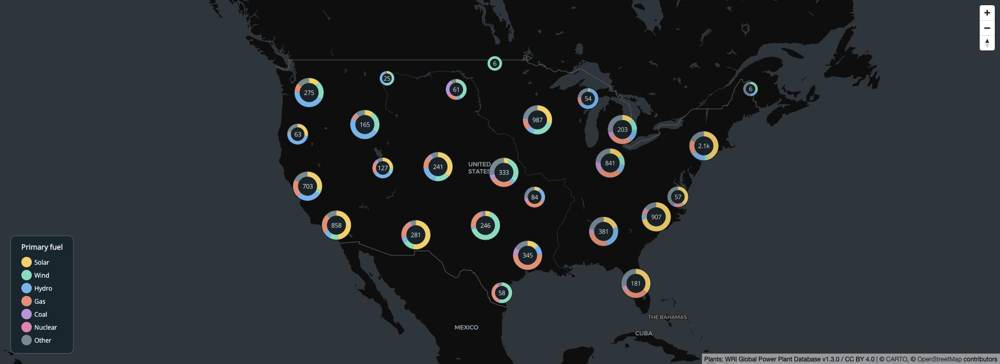
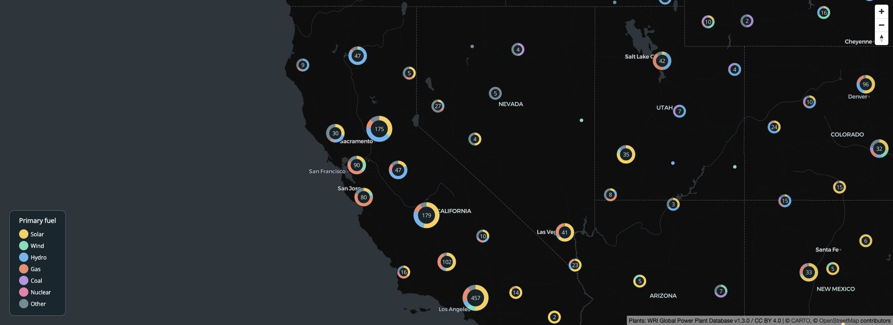

# Point clustering

Let’s make a map of US power plants where each cluster is a donut chart
showing the mix of fuel types. freestiler builds the clusters and
category counts into PMTiles; mapgl draws the donuts from those tile
properties. The browser only downloads the tiles in view.

This example uses the [Global Power Plant
Database](https://github.com/wri/global-power-plant-database) from the
World Resources Institute and partners, licensed under [CC BY
4.0](https://creativecommons.org/licenses/by/4.0/). The download is
pinned to a snapshot of version 1.3.0. It is a historical inventory, not
a current list of operating plants. Each point counts as one plant,
regardless of capacity.



US power plants grouped into donut clusters by primary fuel.

### Install the packages

This example uses the development version of freestiler; categorical
clustering directly from sf objects and GeoDataFrames is not in the
released 0.3.0 packages. The in-memory implementation is compatible with
the CRAN build. Until the next CRAN release, install from R-Universe.
Donut charts need mapgl 0.5.2 or later. Restart R before replacing an
existing installation:

``` r

install.packages(
  "freestiler",
  repos = c("https://walkerke.r-universe.dev", "https://cloud.r-project.org")
)
install.packages(c("mapgl", "sf", "jsonlite", "httpuv"))
```

Run the following sections in order in the same R session. We will read
the data into an sf object and pass it directly to
[`freestile()`](https://walker-data.com/freestiler/reference/freestile.md).
No API key is required.

### Download and prepare the points

``` r

library(sf)
library(freestiler)
library(mapgl)

dir.create("power-plant-demo", showWarnings = FALSE)
csv_path <- "power-plant-demo/power-plants.csv"
data_url <- paste0(
  "https://raw.githubusercontent.com/wri/global-power-plant-database/",
  "7a91cfbb2a4e272597acbc00506d61fc1ec73b3d/",
  "output_database/global_power_plant_database.csv"
)
download.file(data_url, csv_path, mode = "wb")
plants <- read.csv(csv_path)

# Keep the contiguous US and the attributes used in the map.
plants <- subset(
  plants,
  country == "USA" & longitude > -126 & longitude < -66 &
    latitude > 24 & latitude < 50,
  select = c(gppd_idnr, name, primary_fuel, longitude, latitude)
)
plants <- plants[order(plants$gppd_idnr), ]
fuels <- c("Solar", "Wind", "Hydro", "Gas", "Coal", "Nuclear", "Other")
plants$fuel <- ifelse(plants$primary_fuel %in% fuels, plants$primary_fuel, "Other")
plants <- st_as_sf(plants, coords = c("longitude", "latitude"), crs = 4326)
```

This leaves 9,581 plants. Sorting by plant ID fixes the input order,
which matters for reproducible cluster membership. The fuel groups and
their order will be shared by the tiler, the donut charts, and the
legend.

### Build the tiles

``` r

freestile(
  plants,
  "power-plant-demo/plants.pmtiles",
  layer_name = "plants",
  min_zoom = 0,
  max_zoom = 14,
  cluster_distance = 60,
  cluster_maxzoom = 9,
  category = "fuel",
  category_values = fuels
)
```

The archive contains clusters through zoom 9 and individual plants from
zoom 10 onward. Every cluster carries `point_count` and counts named
`fuel:Solar`, `fuel:Wind`, and so on. These are plant counts, not
megawatts or electricity generation. Isolated plants retain their name
and other original attributes.

### Draw donut charts with mapgl

``` r

colors <- c("#f9cf58", "#71debd", "#64b5ee", "#f18c70", "#bb95df", "#ef7daf", "#728a94")
fuel_color <- match_expr("fuel", values = fuels, stops = colors, default = "#728a94")

# Keep this R session running while viewing the map.
serve_tiles("power-plant-demo", port = 8082)

plant_map <- maplibre(
  style = carto_style("dark-matter"),
  center = c(-98, 38.5), zoom = 3.5,
  projection = "mercator", height = 700,
  attributionControl = list(customAttribution = "Plants: WRI Global Power Plant Database v1.3.0 / CC BY 4.0")
) |>
  add_pmtiles_source(
    "plant-source", "http://localhost:8082/plants.pmtiles", maxzoom = 14
  ) |>
  add_circle_layer(
    "plants", source = "plant-source", source_layer = "plants",
    circle_color = fuel_color, circle_radius = 4,
    popup = "name",
    cluster_options = cluster_options(
      max_zoom = 9,
      donut_column = "fuel", donut_values = fuels, donut_colors = colors,
      radius_stops = c(14, 20, 28), count_stops = c(0, 30, 150),
      donut_width = 0.35, donut_fill = "#142329", text_color = "#f6f4e9",
      circle_stroke_color = "#10191e"
    )
  ) |>
  add_categorical_legend(
    "Primary fuel", values = fuels, colors = colors,
    position = "bottom-left", patch_shape = "circle",
    style = legend_style(
      background_color = "#16262e", text_color = "#e7efef",
      title_color = "white", border_color = "#52616a"
    )
  ) |>
  add_navigation_control()

plant_map
```

The number inside each donut is the number of plants. Its slices show
their fuel mix. Because `source` names a PMTiles source, mapgl uses the
clusters freestiler already computed. Passing an sf object as `source`
would instead ask the browser to cluster the points.

Zoom in to see the regional differences. At zoom 10 the clusters give
way to individual plants from the same archive. Click a plant to see its
name.

``` r

set_view(plant_map, center = c(-119, 38), zoom = 5.5)
```



A closer view of power plants in the western US, with smaller donut
clusters and individual plants.

When finished, stop the tile server with `stop_server(port = 8082)`.

### Build the same clusters in Python

In Python, read the data into a GeoDataFrame and pass it to
[`freestile()`](https://walker-data.com/freestiler/reference/freestile.md)
in the same way. Until the next PyPI release, install the development
version from GitHub (building from source requires Rust):

``` bash
pip install "git+https://github.com/walkerke/freestiler.git#subdirectory=python"
```

``` python
from pathlib import Path
import pandas as pd
import geopandas as gpd
from freestiler import freestile

folder = Path("power-plant-demo")
folder.mkdir(exist_ok=True)
data_url = (
    "https://raw.githubusercontent.com/wri/global-power-plant-database/"
    "7a91cfbb2a4e272597acbc00506d61fc1ec73b3d/"
    "output_database/global_power_plant_database.csv"
)
plants = pd.read_csv(data_url, low_memory=False)
plants = plants.loc[
    (plants.country == "USA") & plants.longitude.between(-126, -66, inclusive="neither")
    & plants.latitude.between(24, 50, inclusive="neither"),
    ["gppd_idnr", "name", "primary_fuel", "longitude", "latitude"],
].sort_values("gppd_idnr")
fuels = ["Solar", "Wind", "Hydro", "Gas", "Coal", "Nuclear", "Other"]
plants["fuel"] = plants.primary_fuel.where(plants.primary_fuel.isin(fuels), "Other")
plants = gpd.GeoDataFrame(
    plants, geometry=gpd.points_from_xy(plants.longitude, plants.latitude), crs=4326
).drop(columns=["longitude", "latitude"])

freestile(
    plants, folder / "plants.pmtiles",
    layer_name="plants", min_zoom=0, max_zoom=14,
    cluster_distance=60, cluster_maxzoom=9,
    category="fuel", category_values=fuels,
)
```

This archive can be viewed with the R map code above; load `freestiler`
and `mapgl` and define `fuels` first. The [Python
article](https://walker-data.com/freestiler/articles/python.html#viewing-tiles)
also covers serving PMTiles for other viewers.

### Properties in the tiles

| Property | Meaning |
|----|----|
| `cluster` | `true` for a cluster; absent on a singleton. |
| `cluster_id` | Identifier for a cluster. |
| `point_count` | Total number of input points in the cluster. |
| `point_count_abbreviated` | Abbreviated count for labels, such as `"1.2k"`. |
| `cluster_expansion_zoom` | Zoom level where the cluster splits, useful for click-to-zoom. |
| `fuel:Solar`, `fuel:Wind`, etc. | Counts for the declared categories. |
| `fuel:_other` | Count of missing or unlisted categories. |

The category counts sum to `point_count`. Divide a category count by
`point_count` to calculate its share. Singletons retain their original
attributes and category counts, but have no `point_count` property.
Clusters do not inherit an arbitrary member’s attributes, such as its
name.

The example explicitly groups less common fuels into `"Other"`, so those
counts live in `fuel:Other`. The separate `fuel:_other` field is for
values outside the declared dictionary. Zero-count categories are
retained.

### Zooms and memory

Categorical clustering uses Supercluster 8.0.1 with a 512-pixel tile
extent. It accepts a single POINT sf object or GeoDataFrame and a
dictionary of 1 to 64 distinct strings or whole numbers. Input is
reprojected to WGS84 as needed. Changing row order can change cluster
membership.

Use `cluster_maxzoom` to choose the last zoom with clusters. Individual
points fill the remaining zooms through `max_zoom`. Keep `base_zoom`
unset and `simplification` at its default, and omit `drop_rate` and
`coalesce` so all points contribute to the counts.

The input and global clustering index stay in memory. Tile output and
singleton attributes are stored on disk, but this is not the streaming
query pipeline. The input must contain fewer than `2^31` rows. Select
only the properties you need.

For data already stored in GeoParquet,
[`freestile_file()`](https://walker-data.com/freestiler/reference/freestile_file.md)
also supports categories in the released 0.3.0 packages. That path
requires native GeoParquet support (R-Universe or Python), WGS84 POINT
input, and `cluster_maxzoom = max_zoom`; it currently writes clustered
zooms only.

For summaries on a fixed grid, including the most common category and
its share, use [H3
binning](https://walker-data.com/freestiler/articles/h3-hexagonal-binning.html#hex-only-and-categorical-maps).
