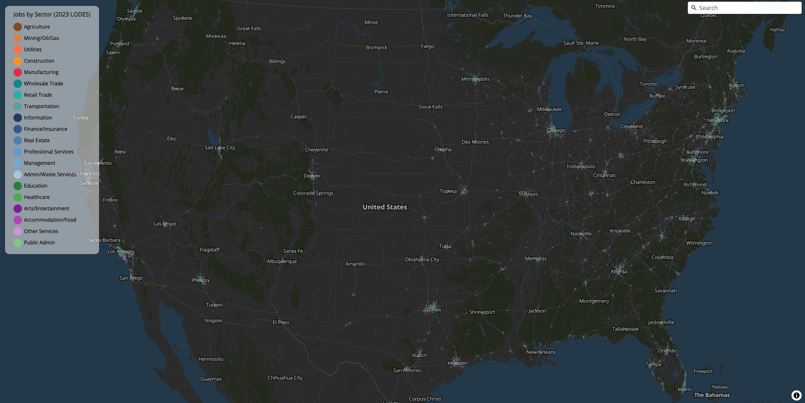
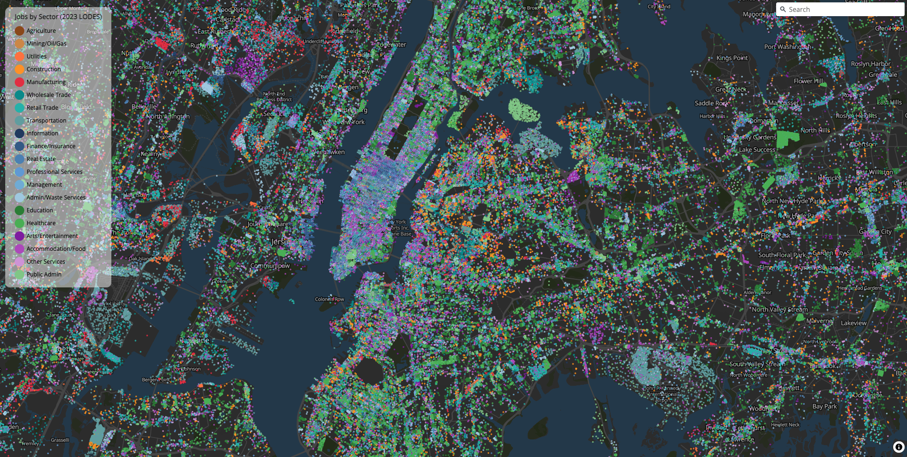

```{r}
#| include: false
#| eval: false
library(freestiler)
```

## Overview

freestiler is a Rust-powered vector tile engine for R and Python. It takes sf data frames or GeoDataFrames and produces [PMTiles](https://github.com/protomaps/PMTiles) archives -- self-contained, single-file tilesets that can be served statically or viewed locally. The whole pipeline runs in-process: no tippecanoe, no Java, no Go.

freestiler supports two tile formats:

-   **MLT (MapLibre Tiles)** -- the default. A next-generation columnar binary format for efficient vector tile encoding.
-   **MVT (Mapbox Vector Tiles)** -- the widely supported protobuf-based format.

The package is designed for two very different use cases:

-   small reproducible examples, where you want a quick path from spatial data to PMTiles
-   serious tiling jobs, where your data already lives in DuckDB and you want to stream directly from SQL

## Installation

### R

Install from [r-universe](https://walkerke.r-universe.dev):

``` r
install.packages("freestiler", repos = "https://walkerke.r-universe.dev")
```

The `r-universe` build is the recommended install for serious DuckDB-backed workloads. Native macOS and Linux builds include the Rust DuckDB backend by default, including the streaming point pipeline used by `freestile_query()`. Windows currently uses the R `duckdb` fallback by default while the GNU DuckDB toolchain issue is sorted out.

Or install the development version from GitHub:

``` r
# install.packages("devtools")
devtools::install_github("walkerke/freestiler")
```

### Python

Install from PyPI:

``` bash
pip install freestiler
```

Published wheels include the native feature set, including DuckDB-backed file input and SQL query support.

See the [Python Setup](python.html) article for detailed installation instructions, virtual environment setup, and optional source builds.

## What makes freestiler different

-   One Rust tiling engine for both R and Python
-   PMTiles output by default
-   Direct file tiling without loading everything into R or Python first
-   DuckDB query tiling
-   Streaming point pipeline for large DuckDB queries
-   Cross-platform support (Windows, MacOS, Linux)

## A serious-workload example

The small examples in this vignette are reproducible and easy to follow. But the same API is built to handle much larger jobs.

On a recent local run, `freestile_query()` streamed `146,575,672` US job points from DuckDB into an MVT PMTiles archive in about `12 minutes`, producing a `2.3 GB` output with `978,589` tiles.

```{r}
#| eval: false
freestile_query(
  query = "SELECT naics, state, ST_Point(lon, lat) AS geometry FROM jobs_dots",
  output = "us_jobs_dots.pmtiles",
  db_path = db_path,
  layer_name = "jobs",
  tile_format = "mvt",
  min_zoom = 4,
  max_zoom = 14,
  base_zoom = 14,
  drop_rate = 2.5,
  source_crs = "EPSG:4326",
  streaming = "always",
  overwrite = TRUE
)
```





## Creating your first tileset

The main function is `freestile()`. Pass it spatial data and an output path.

**R**

```{r}
#| eval: false
library(sf)
library(freestiler)

nc <- st_read(system.file("shape/nc.shp", package = "sf"))

freestile(nc, "nc_counties.pmtiles", layer_name = "counties")
```

```         
Creating MLT tiles (zoom 0-14) for 100 features across 1 layer...
  Tiling layer 'counties' (zoom 0-14)...
Created nc_counties.pmtiles (65.2 KB)
```

This counties example is intentionally simple. It is useful for verifying that your installation works, but it is not the most interesting demonstration of what the package can do.

**Python**

``` python
import geopandas as gpd
from freestiler import freestile

gdf = gpd.read_file("nc.shp")

freestile(gdf, "nc_counties.pmtiles", layer_name="counties")
```

```         
Creating MLT tiles (zoom 0-14) for 100 features across 1 layer...
  Tiling layer 'counties' (zoom 0-14)...
Created nc_counties.pmtiles (65.2 KB)
```

## Viewing tiles

### R

Use the [mapgl](https://walker-data.com/mapgl/) package to view your tileset in R. mapgl supports both MLT and MVT tiles. PMTiles need HTTP range requests, so start a local file server first:

``` bash
# Serve from /tmp on port 8082 (pick whichever you prefer)
npx http-server /tmp -p 8082 --cors -c-1
```

Then point mapgl at the URL:

```{r}
#| eval: false
library(mapgl)

maplibre() |>
  add_pmtiles_source(
    id = "counties-src",
    url = "http://localhost:8082/nc_counties.pmtiles"
  ) |>
  add_fill_layer(
    id = "county-fill",
    source = "counties-src",
    source_layer = "counties",
    fill_color = "#00897b",
    fill_opacity = 0.5
  ) |>
  add_line_layer(
    id = "county-borders",
    source = "counties-src",
    source_layer = "counties",
    line_color = "#004d40",
    line_width = 1
  )
```

### Python

Python viewer stacks are less settled than the R `mapgl` path. For maximum compatibility today, create tiles with `tile_format="mvt"`:

``` python
freestile(gdf, "nc_mvt.pmtiles", layer_name="counties", tile_format="mvt")
```

Viewer support for MLT in Python will improve as Python wrappers catch up with current MapLibre GL JS releases. In the meantime, MVT is the safe default for Python-facing examples, and either MVT or MLT can be viewed directly in the browser with current [MapLibre GL JS](https://maplibre.org/).

## MLT vs MVT format

The default format is MLT (MapLibre Tiles). To use MVT instead:

**R**

```{r}
#| eval: false
freestile(nc, "nc_mvt.pmtiles", layer_name = "counties", tile_format = "mvt")
```

**Python**

``` python
freestile(gdf, "nc_mvt.pmtiles", layer_name="counties", tile_format="mvt")
```

MLT is a columnar encoding that can be more compact than MVT, especially for polygon-heavy datasets. MVT is the universal fallback supported by all mapping libraries. Use MVT when maximum viewer compatibility is needed -- particularly for Python viewers today and for large public-facing point tilesets.

## Controlling zoom levels

The `min_zoom` and `max_zoom` parameters control the zoom range.

**R**

```{r}
#| eval: false
freestile(nc, "nc_z4_10.pmtiles",
  layer_name = "counties",
  min_zoom = 4,
  max_zoom = 10
)
```

**Python**

``` python
freestile(gdf, "nc_z4_10.pmtiles",
    layer_name="counties",
    min_zoom=4,
    max_zoom=10
)
```

## Feature dropping with drop_rate

For large datasets, `drop_rate` provides exponential feature thinning at lower zoom levels. Points are thinned using spatial ordering (Morton curve) to maintain even coverage; polygons and lines are thinned by area.

The `base_zoom` parameter controls the zoom level above which all features are present. Below `base_zoom`, features are progressively thinned. By default, `base_zoom` equals `max_zoom`.

**R**

```{r}
#| eval: false
freestile(nc, "nc_dropping.pmtiles",
  layer_name = "counties",
  drop_rate = 2.5,
  base_zoom = 10
)
```

**Python**

``` python
freestile(gdf, "nc_dropping.pmtiles",
    layer_name="counties",
    drop_rate=2.5,
    base_zoom=10
)
```

## Direct file input

Tile spatial files directly without loading them into R or Python first.

**R** -- supports GeoParquet, GeoPackage, Shapefile, and other formats via DuckDB:

```{r}
#| eval: false
# GeoParquet (uses the geoparquet engine)
freestile_file("census_blocks.parquet", "blocks.pmtiles")

# GeoPackage, Shapefile, or other formats (uses the DuckDB engine)
freestile_file("counties.gpkg", "counties.pmtiles", engine = "duckdb")
```

**Python** -- published wheels include the DuckDB engine, so GeoPackage, Shapefile, and other DuckDB-backed formats work out of the box:

``` python
from freestiler import freestile_file

# GeoParquet (uses the geoparquet engine)
freestile_file("census_blocks.parquet", "blocks.pmtiles")

# GeoPackage, Shapefile, or other formats (uses the DuckDB engine)
freestile_file("counties.gpkg", "counties.pmtiles", engine="duckdb")
```

## SQL queries with DuckDB

Run a SQL query through DuckDB's spatial extension and pipe the results directly into the tiling engine. Filter, join, and transform your data with SQL before tiling.

**R**

```{r}
#| eval: false
freestile_query(
  "SELECT * FROM ST_Read('counties.shp') WHERE pop > 50000",
  "large_counties.pmtiles"
)

freestile_query(
  "SELECT * FROM read_parquet('blocks.parquet') WHERE state = 'NC'",
  "nc_blocks.pmtiles"
)
```

**Python**

``` python
from freestiler import freestile_query

freestile_query(
    "SELECT * FROM ST_Read('counties.shp') WHERE pop > 50000",
    "large_counties.pmtiles"
)

freestile_query(
    "SELECT * FROM read_parquet('blocks.parquet') WHERE state = 'NC'",
    "nc_blocks.pmtiles"
)
```

For very large point datasets, set `streaming = "always"` to force the streaming point pipeline:

```{r}
#| eval: false
freestile_query(
  query = "SELECT category, ST_Point(lon, lat) AS geometry FROM points_table",
  output = "points.pmtiles",
  layer_name = "points",
  tile_format = "mvt",
  min_zoom = 4,
  max_zoom = 14,
  base_zoom = 14,
  drop_rate = 2.5,
  source_crs = "EPSG:4326",
  streaming = "always"
)
```

## Multi-layer tiles

Pass a named list (R) or dictionary (Python) to create multi-layer tilesets.

**R**

```{r}
#| eval: false
pts <- st_centroid(nc)

freestile(
  list(counties = nc, centroids = pts),
  "nc_layers.pmtiles"
)
```

Use `freestile_layer()` for per-layer zoom control:

```{r}
#| eval: false
freestile(
  list(
    counties = freestile_layer(nc, min_zoom = 0, max_zoom = 10),
    centroids = freestile_layer(pts, min_zoom = 6, max_zoom = 14)
  ),
  "nc_layers.pmtiles"
)
```

**Python** -- use `freestile_layer()` for per-layer zoom control:

``` python
from freestiler import freestile, freestile_layer

centroids = gdf.copy()
centroids.geometry = gdf.geometry.centroid

freestile(
    {
        "counties": freestile_layer(gdf, min_zoom=0, max_zoom=10),
        "centroids": freestile_layer(centroids, min_zoom=6, max_zoom=14),
    },
    "nc_layers.pmtiles"
)
```

## Point clustering

For point layers, `cluster_distance` merges nearby points into clusters with a `point_count` attribute.

**R**

```{r}
#| eval: false
freestile(pts, "nc_clustered.pmtiles",
  layer_name = "centroids",
  cluster_distance = 50,
  cluster_maxzoom = 8
)
```

**Python**

``` python
freestile(centroids, "nc_clustered.pmtiles",
    layer_name="centroids",
    cluster_distance=50,
    cluster_maxzoom=8
)
```

## Feature coalescing

The `coalesce` parameter merges features with identical attributes within each tile. Lines sharing endpoints are joined; polygons are grouped into MultiPolygons.

**R**

```{r}
#| eval: false
freestile(nc, "nc_coalesced.pmtiles",
  layer_name = "counties",
  coalesce = TRUE
)
```

**Python**

``` python
freestile(gdf, "nc_coalesced.pmtiles",
    layer_name="counties",
    coalesce=True
)
```
