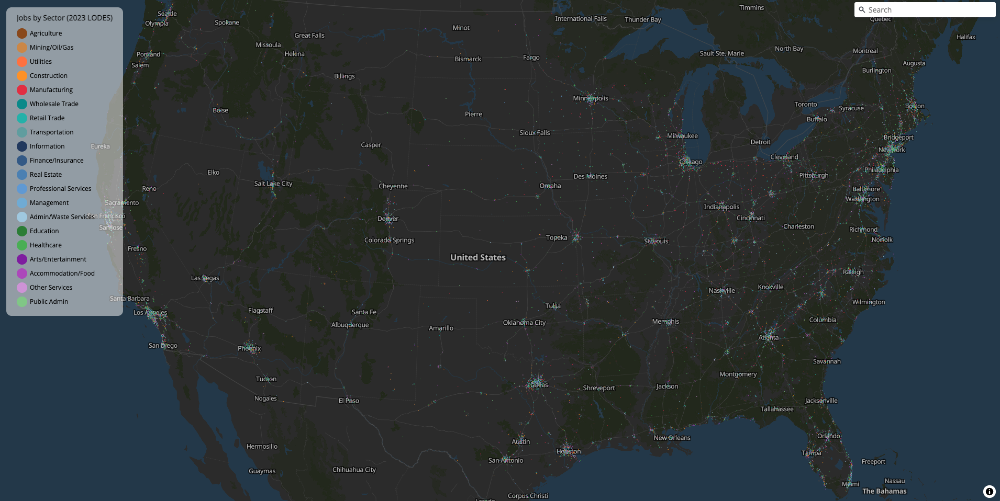
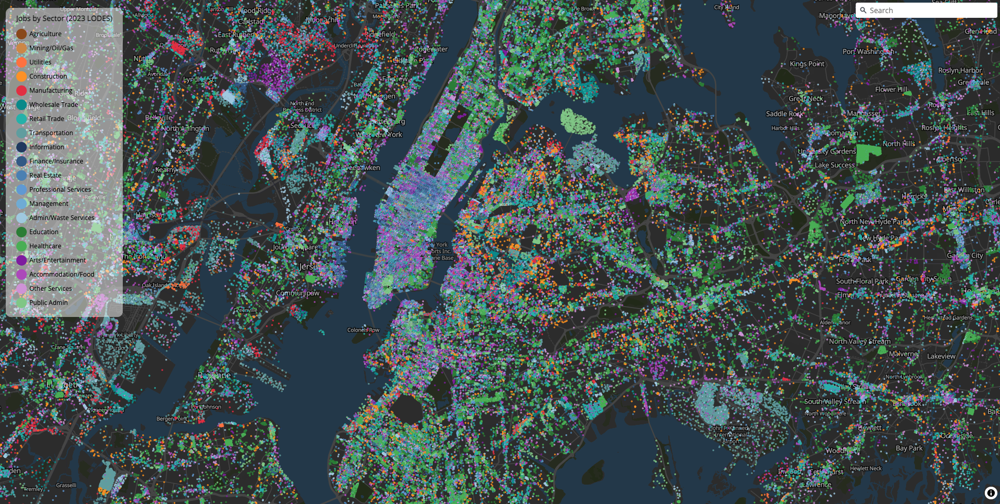

```{r}
#| include: false
#| eval: false
library(freestiler)
```

freestiler is a vector tile engine for R (and Python) that creates [PMTiles](https://github.com/protomaps/PMTiles) archives from spatial data. You give it an sf object, a file on disk, or a DuckDB query, and it writes a single `.pmtiles` file you can serve from anywhere. The engine is written in Rust and runs in-process, so there's nothing else to install.

The default tile format is [Mapbox Vector Tiles (MVT)](https://github.com/mapbox/vector-tile-spec), the widely-supported protobuf format that works with both MapLibre GL JS and Mapbox GL JS (which now supports PMTiles natively). The package also supports [MapLibre Tiles (MLT)](https://github.com/maplibre/maplibre-tile-spec), a next-generation columnar format. See the [MapLibre Tiles](maplibre-tiles.html) article for more on the differences.

sf inputs and CRS-tagged DuckDB geometry are reprojected to WGS84 (EPSG:4326) before tiling. When a query creates geometry from coordinates, use longitude and latitude in that order. Categorical file clustering requires a GeoParquet file already in WGS84.

### Installation

Install from CRAN for tiling sf objects, including ordinary point clustering and H3 binning:

``` r
install.packages("freestiler")
```

For native GeoParquet input, categorical file clustering, or streaming point queries, install from [R-Universe](https://walkerke.r-universe.dev). Restart R before replacing an existing installation:

``` r
install.packages(
  "freestiler",
  repos = c("https://walkerke.r-universe.dev", "https://cloud.r-project.org")
)
```

The builds differ in their optional dependencies:

| Feature | R: CRAN | R: R-Universe | Python: PyPI wheels |
|---------|---------|---------------|---------------------|
| In-memory tiling | sf | sf | GeoDataFrame |
| Native GeoParquet input and categorical file clusters | No | Yes | Yes |
| DuckDB file input and SQL queries | R `duckdb` fallback | Native on macOS/Linux; R fallback on Windows | Native |
| Streaming point queries | No | macOS/Linux | Yes |
| H3 binning | With R `DBI` and `duckdb` | With R `DBI` and `duckdb` | With the `h3` extra |

The R DuckDB fallback loads query results into an sf object before tiling. Install `DBI` and `duckdb` to use it. H3 binning uses the host language's DuckDB package and is available with the CRAN build; it does not require native Rust DuckDB.

For Python, see the [Python Setup](python.html) article.

### Your first tileset

The main function is `freestile()`. Let's tile the North Carolina counties dataset that ships with sf:

```{r}
#| eval: false
library(sf)
library(freestiler)

nc <- st_read(system.file("shape/nc.shp", package = "sf"))

freestile(nc, "nc_counties.pmtiles", layer_name = "counties")
```

```
Creating MVT tiles (zoom 0-14) for 100 features across 1 layer...
  Tiling layer 'counties' (zoom 0-14)...
Created nc_counties.pmtiles (65.2 KB)
```

That's useful for verifying your installation, but let's try something more interesting.

### A more interesting example

Let's tile all 242,000 US block groups from the [tigris](https://github.com/walkerke/tigris) package. This takes about 20 seconds on my machine and produces a tileset you can zoom into from the national level down to individual neighborhoods:

```{r}
#| eval: false
library(tigris)
options(tigris_use_cache = TRUE)

bgs <- block_groups(cb = TRUE)

freestile(
  bgs,
  "us_bgs.pmtiles",
  layer_name = "bgs",
  min_zoom = 4,
  max_zoom = 12
)
```

### Viewing tiles

The quickest way to view a tileset is `view_tiles()`, which starts a local HTTP server and creates an interactive map in one step:

```{r}
#| eval: false
view_tiles("us_bgs.pmtiles")
```

It auto-detects the layer name and geometry type from the PMTiles metadata, so it works out of the box for polygon, line, and point data.

For more control over styling and layers, use `serve_tiles()` to start the server separately and build your map with [mapgl](https://walker-data.com/mapgl/). See the [Mapping with mapgl](mapping.html) article for a full walkthrough of this workflow.

The built-in server handles CORS and HTTP range requests automatically. For tilesets larger than ~1 GB, you'll get better performance from an external server:

``` bash
npx http-server /path/to/tiles -p 8082 --cors -c-1
```

### MVT vs MLT

The default tile format is MVT, which has broad viewer compatibility including both MapLibre GL JS and Mapbox GL JS. For potentially smaller files with polygon-heavy data, you can use the experimental MLT format:

```{r}
#| eval: false
freestile(nc, "nc_mlt.pmtiles", layer_name = "counties", tile_format = "mlt")
```

### Controlling zoom levels

Use `min_zoom` and `max_zoom` to set the zoom range for your tileset:

```{r}
#| eval: false
freestile(nc, "nc_z4_10.pmtiles",
  layer_name = "counties",
  min_zoom = 4,
  max_zoom = 10
)
```

### Feature dropping for large datasets

For large datasets, `drop_rate` provides exponential feature thinning at lower zoom levels. Points are thinned using spatial ordering to maintain even coverage; polygons and lines are thinned by area. The `base_zoom` parameter controls the zoom level above which all features are kept:

```{r}
#| eval: false
freestile(nc, "nc_dropping.pmtiles",
  layer_name = "counties",
  drop_rate = 2.5,
  base_zoom = 10
)
```

### Direct file input

You can tile spatial files on disk without loading them into R first. This is useful for large GeoParquet files or other formats you'd rather not pull into memory. Non-WGS84 files are automatically reprojected:

```{r}
#| eval: false
# GeoParquet
freestile_file("census_blocks.parquet", "blocks.pmtiles")

# GeoPackage, Shapefile, or other formats via DuckDB
freestile_file("counties.gpkg", "counties.pmtiles", engine = "duckdb")
```

### DuckDB queries

If your data already lives in DuckDB, you can run a SQL query and pipe the results directly into the tiling engine. This lets you filter, join, and transform your data with SQL before tiling:

```{r}
#| eval: false
freestile_query(
  "SELECT * FROM ST_Read('counties.shp') WHERE pop > 50000",
  "large_counties.pmtiles"
)
```

CRS-tagged query results are automatically reprojected by the native DuckDB reader. With the R fallback, always pass `source_crs`, for example `"EPSG:4326"` when the query already returns WGS84. Native GeoParquet and DuckDB readers, along with the R DuckDB fallback, write dates as `YYYY-MM-DD` text and timestamps with a `T` separator. Zoned timestamps use UTC with a `Z` suffix. Missing values remain missing.

For very large point datasets, set `streaming = "always"` to use the streaming pipeline, which avoids loading the full query result into memory:

```{r}
#| eval: false
freestile_query(
  query = "SELECT naics, state, ST_Point(lon, lat) AS geometry FROM jobs_dots",
  output = "us_jobs_dots.pmtiles",
  db_path = db_path,
  layer_name = "jobs",
  tile_format = "mvt",
  min_zoom = 4,
  max_zoom = 14,
  base_zoom = 14,
  drop_rate = 2.5,
  source_crs = "EPSG:4326",
  streaming = "always",
  overwrite = TRUE
)
```

On a recent run, this streamed 146 million US job points from DuckDB into a 2.3 GB PMTiles archive in about 12 minutes.





### Planning a large job

Streaming currently supports POINT queries without clustering. Line and polygon inputs still need memory for the decoded geometries, even though encoded tiles are written to a temporary file as they are produced. Categorical clustering keeps its global point index in memory, and H3 binning keeps the output hexagons in memory.

Leave space for both temporary files and the final PMTiles archive. Streaming also writes point partitions and may spill DuckDB work to disk, so temporary storage can be substantially larger than the finished map. Select only the attributes you need in the query.

For streaming jobs, these environment variables can help:

| Variable | Purpose |
|----------|---------|
| `FREESTILER_TEMP_DIR` | Put temporary partitions and DuckDB spill files on a disk with enough space. |
| `FREESTILER_DUCKDB_MEMORY` | Set DuckDB's memory limit, such as `4GB`. This is not a limit on the whole process. |
| `FREESTILER_STREAM_WORKERS` | Number of partitions tiled at once; defaults to 1. More workers need more memory. |

The output file is replaced only after a successful build. If a dense tile exceeds a memory budget, try `drop_rate` or a higher `min_zoom` before increasing the budget.

### Multi-layer tilesets

Pass a named list to create multi-layer tilesets. Use `freestile_layer()` if you want per-layer zoom control:

```{r}
#| eval: false
pts <- st_centroid(nc)

freestile(
  list(
    counties = freestile_layer(nc, min_zoom = 0, max_zoom = 10),
    centroids = freestile_layer(pts, min_zoom = 6, max_zoom = 14)
  ),
  "nc_layers.pmtiles"
)
```

### Point clustering

For point layers, `cluster_distance` merges nearby points into clusters with a `point_count` attribute:

```{r}
#| eval: false
freestile(pts, "nc_clustered.pmtiles",
  layer_name = "centroids",
  cluster_distance = 50,
  cluster_maxzoom = 8
)
```

To retain the mix of categories within clusters, use `freestile_file()` with `category` and `category_values`. See [Point clustering](point-clustering.html) for R and Python examples and the distinction between the two clustering paths.

### Feature coalescing

The `coalesce` parameter merges features with identical attributes within each tile. Lines sharing endpoints are joined, and polygons are grouped into MultiPolygons:

```{r}
#| eval: false
freestile(nc, "nc_coalesced.pmtiles",
  layer_name = "counties",
  coalesce = TRUE
)
```
