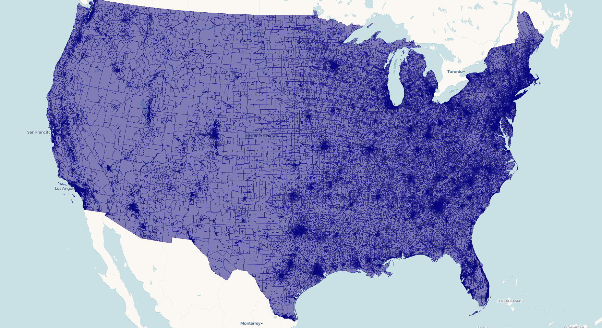
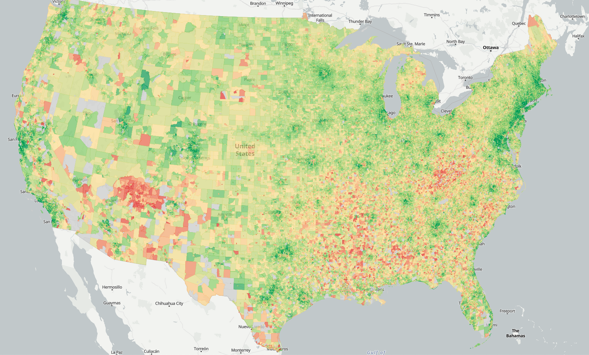

```{r}
#| include: false
#| eval: false
library(freestiler)
library(mapgl)
```

This article walks through viewing and styling freestiler tilesets with the [mapgl](https://walker-data.com/mapgl/) package. We'll build a national-level choropleth of median household income by Census block group — 242,000 polygons that render smoothly because they're served as vector tiles.

### Creating the tileset

First, pull block group geometries and income data with [tidycensus](https://walker-data.com/tidycensus/):

```{r}
#| eval: false
library(tidycensus)
library(freestiler)
options(tigris_use_cache = TRUE)

# Pulls data state-by-state, so will take a few minutes if 
# geometries are not pre-cached
bgs <- get_acs(
  geography = "block group",
  variables = "B19013_001",  # median household income
  state = c(state.abb, "DC"),
  year = 2024,
  geometry = TRUE
)

freestile(
  bgs,
  "us_income.pmtiles",
  layer_name = "income",
  min_zoom = 4,
  max_zoom = 12
)
```

The actual tiling takes a few minutes and produces a \~250 MB tileset. The output will include:

```         
Created us_income.pmtiles (252.6 MB)
View with: view_tiles("us_income.pmtiles")
```

### Quick preview

For a fast look at your tileset, use `view_tiles()`:

```{r}
#| eval: false
view_tiles("us_income.pmtiles")
```



This auto-detects the layer name, geometry type, and bounds from the PMTiles metadata, starts a local server, and opens an interactive map. It works for polygon, line, and point data without any extra configuration. FYI, for this specific example - given the USA's bounding box, you'll need to pan over to the continental US to view it.

### Building a custom map

For control over styling, use `serve_tiles()` to start the local server, then build your map with mapgl. PMTiles require a server that supports CORS and HTTP range requests — `serve_tiles()` handles both.

```{r}
#| eval: false
library(mapgl)

serve_tiles("us_income.pmtiles")
```

Now add the tileset as a source and style it:

```{r}
#| eval: false
maplibre(
  style = openfreemap_style("positron"),
  bounds = c(-125, 24, -66, 50), 
) |>
  add_pmtiles_source(
    id = "income-src",
    url = "http://localhost:8080/us_income.pmtiles",
    promote_id = "GEOID"
  ) |>
  add_fill_layer(
    id = "income-fill",
    source = "income-src",
    source_layer = "income",
    fill_color = interpolate(
      column = "estimate",
      values = c(20000, 50000, 100000, 200000),
      stops = c("#d73027", "#fee08b", "#91cf60", "#1a9850"),
      na_color = "#cccccc"
    ),
    fill_opacity = 0.7,
    hover_options = list(
      fill_opacity = 1
    ),
    tooltip = concat(
      "Median income: $",
      number_format(get_column("estimate"), locale = "en")
    )
  )
```



Key components:

-   **`add_pmtiles_source()`** registers the PMTiles file as a vector tile source. The `promote_id` parameter tells MapLibre which property to use as the feature ID (needed for hover/click interactivity).
-   **`source_layer`** must match the `layer_name` you used in `freestile()`.
-   **`interpolate()`** creates a data-driven color ramp. MapLibre evaluates this per-feature on the GPU, so it's fast even at 242K polygons.
-   **`hover_options`** highlights features on mouseover. This requires `promote_id` to be set on the source.
-   **`tooltip`** uses `concat()` and `number_format()` to build formatted hover text from feature properties.

### Line and point layers

For line data, use `add_line_layer()`:

```{r}
#| eval: false
maplibre() |>
  add_pmtiles_source(
    id = "roads-src",
    url = "http://localhost:8080/roads.pmtiles"
  ) |>
  add_line_layer(
    id = "roads",
    source = "roads-src",
    source_layer = "roads",
    line_color = "#4a90d9",
    line_width = 1.5
  )
```

For point data, use `add_circle_layer()`:

```{r}
#| eval: false
maplibre() |>
  add_pmtiles_source(
    id = "pts-src",
    url = "http://localhost:8080/airports.pmtiles"
  ) |>
  add_circle_layer(
    id = "airports",
    source = "pts-src",
    source_layer = "airports",
    circle_color = "orange",
    circle_radius = 5,
    circle_stroke_color = "white",
    circle_stroke_width = 1
  )
```

### Multi-layer tilesets

If your tileset has multiple layers (created with a named list in `freestile()`), add each layer separately — they share the same source:

```{r}
#| eval: false
maplibre() |>
  add_pmtiles_source(
    id = "nc-src",
    url = "http://localhost:8080/nc_layers.pmtiles"
  ) |>
  add_fill_layer(
    id = "counties",
    source = "nc-src",
    source_layer = "counties",
    fill_color = "navy",
    fill_opacity = 0.3
  ) |>
  add_circle_layer(
    id = "centroids",
    source = "nc-src",
    source_layer = "centroids",
    circle_color = "red",
    circle_radius = 4
  )
```

### Tile format considerations

freestiler defaults to [MapLibre Tiles (MLT)](maplibre-tiles.html), which produces smaller files. `view_tiles()` and mapgl handle MLT natively with recent versions of MapLibre GL JS. If you're sharing tiles with other tools or viewers, use `tile_format = "mvt"` for the widest compatibility:

```{r}
#| eval: false
freestile(bgs, "us_income_mvt.pmtiles",
  layer_name = "income",
  tile_format = "mvt"
)
```

### Serving larger tilesets

The built-in `serve_tiles()` server works well for files up to about 1 GB. For larger tilesets, use an external server with better concurrency. In your terminal, assuming you have Node's `http-server` installed:

``` bash
npx http-server /path/to/tiles -p 8082 --cors -c-1
```

Then point your `add_pmtiles_source()` URL at `http://localhost:8082/...` instead. Stop the external server with Ctrl+C in the terminal when you're done.

You'll see better performance with this method than the built-in server for datasets below 1GB as well, like the block groups dataset in this example.

### Cleaning up

When you're done viewing with the built-in server, stop it with:

```{r}
#| eval: false
stop_server()
```